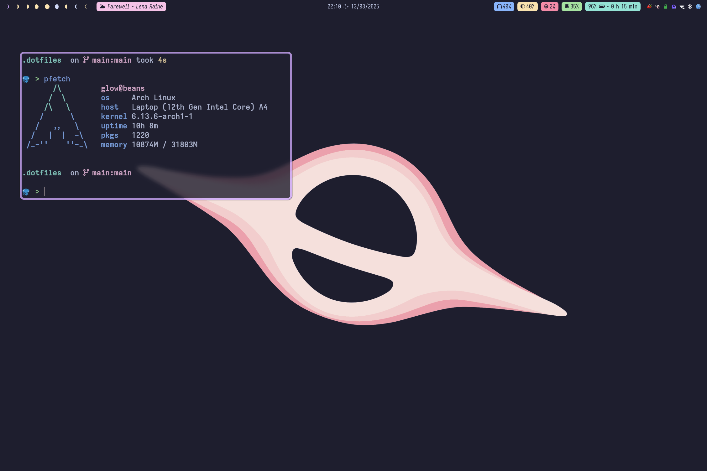
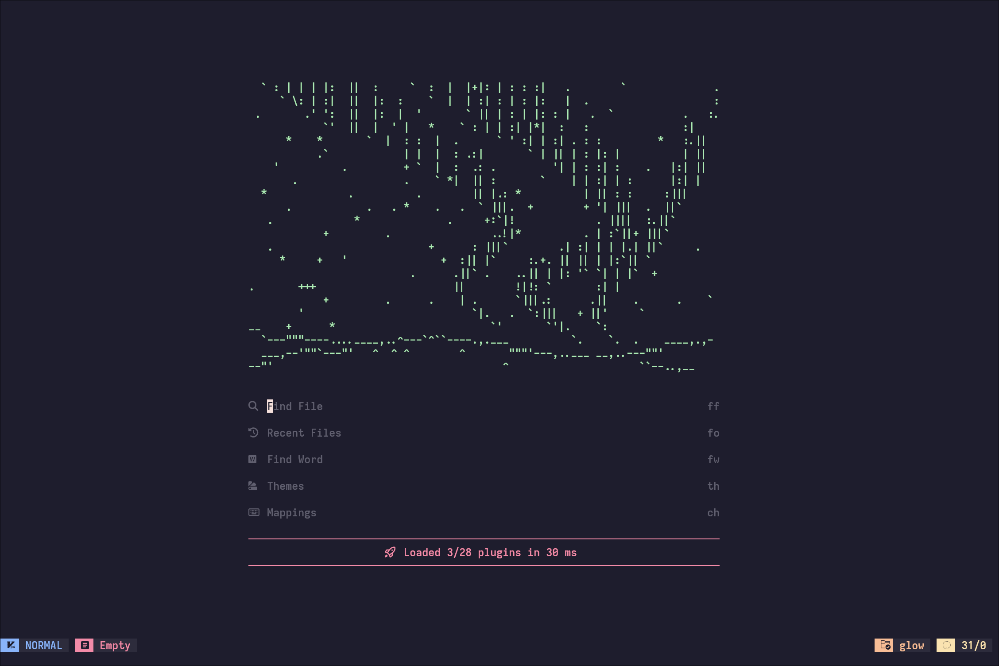
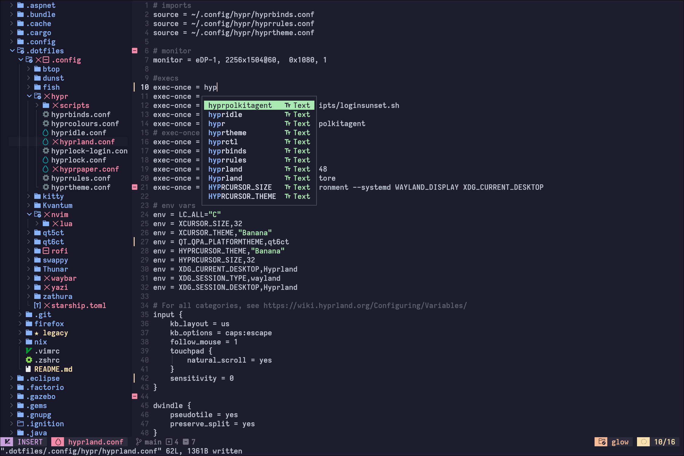

# 🌙 astral dots repo 🌙

Dotfiles for my setup using [Hyprland](https://hyprland.org/) on [Arch](https://archlinux.org/)

Primarily based on the [Catppuccin](https://catppuccin.com/) colour scheme

this repo has my configs for:
- [fish (with fisher)](https://fishshell.com/)
- [hyprland](https://hyprland.org/)
- [kitty](https://sw.kovidgoyal.net/kitty/)
- [neovim](https://neovim.io/)
  - just my options for [NvChad](https://nvchad.com/)
- [rofi (wayland)](https://github.com/davatorium/rofi)
- [waybar](https://github.com/Alexays/Waybar)
- [starship](https://starship.rs/)

screenshots:

and some others.

This is mainly for me, but if you want to use it and modify it for yourself you're absolutely welcome!
